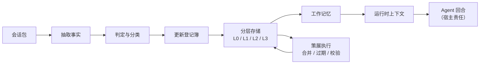

# PruneMem

面向 AI agent 的记忆治理系统——带结构、带状态、带生命周期。

---

## 问题所在

大多数 agent 用得越久，记忆越乱。

- 找过的东西反复搜
- 不重要的小事和关键决策搅在一起
- 旧的笔记从来没被清理过，越积越多
- 正在进行的任务和已经归档的内容混在一起
- 长时间运行的任务不知道做到哪了

常见的补救手段——更大的上下文窗口、更聪明的检索、手动调 prompt——都没触及根源：**缺乏治理的记忆**。信息需要组织、过期和维护，和其他系统一样。

## PruneMem 的解决思路

PruneMem 把 agent 的记忆当作基础设施层，围绕三个核心思想设计：

- **结构** — 分层长期记忆（L0–L3），让检索知道该优先拿什么
- **状态** — 工作记忆和运行时上下文，保持当前会话的连续性
- **生命周期** — 自动治理（合并、过期、校验、修复），让记忆层长期保持干净

PruneMem 不替代你的向量存储或检索机制。它坐在更上游：你给它会话记录或事实，它判断该留什么、该放哪，并维护供检索层查询的登记簿。

## 这个仓库包含什么

这个仓库包含：

- 核心记忆治理操作（抽取、判定、策展、校验、维护）
- 分层登记簿实现（L0 临时 → L3 规范）
- 工作记忆和执行上下文原语
- 会话归档构建器
- MCP 服务器，暴露 11 个 tool，可接入任何兼容 MCP 的宿主

它**不包含**：

- 私有工作空间数据或聊天记录
- 硬编码的厂商集成（用适配器替代）
- 检索机制（读路径是宿主的责任）
- 生产环境的密钥或凭证

## 当前版本状态

**当前版本：`0.3.0`**

新增 MCP 服务器支持，让 PruneMem 可以作为标准 MCP tool 服务器被任何兼容宿主使用。

版本历史见 [CHANGELOG.md](CHANGELOG.md)。

## 架构概览



**数据流：** 会话包经过抽取 → 判定 → 登记簿更新。登记簿驱动分层存储、工作记忆和运行时上下文。后台策展进程持续维护登记簿健康。

## 快速开始

> **本节将在 Phase 6.4（Hermes 集成测试）完成后填写。**
>
> 作者目前正在进行 PruneMem 与 Hermes Agent 的真实集成测试。在此之前写一份"30 秒上手指南"只能是猜测。本节将基于实际部署经验编写，而非假设。
>
> 在此期间，请参阅 [docs/mcp-server.md](docs/mcp-server.md) 了解协议层配置。宿主专属集成指南（docs/integrations/）将在 Step 6 各 phase 逐步完善。

## 集成指南

宿主专属配置指南（Step 6 各 phase 逐步完善）：

- [MCP 能力面](docs/integrations/mcp-surface.zh.md)（快查表）
- [Hermes Agent](docs/integrations/hermes.zh.md)
- [Claude Code](docs/integrations/claude-code.zh.md)
- [Codex CLI](docs/integrations/codex-cli.zh.md)
- [故障排查](docs/integrations/troubleshooting.zh.md)

## MCP 能力

PruneMem 将记忆治理操作暴露为 [MCP](https://modelcontextprotocol.io) 服务器，包含 **11 个 tool**（stdio 传输）。

这意味着 PruneMem 可以接入任何兼容 MCP 的宿主：

- [Hermes Agent](https://hermes-agent.nousresearch.com)
- [Claude Code](https://docs.claude.com/en/docs/claude-code)
- [Codex CLI](https://developers.openai.com/codex)
- 任何其他 MCP 宿主

完整的 tool 参考见 [docs/mcp-tools.md](docs/mcp-tools.md)，协议详情见 [docs/mcp-server.md](docs/mcp-server.md)。

## 安全默认设置

PruneMem 默认开启两层写入保护：

1. **默认 dry-run** — 所有写类 MCP tool 默认 `write: false`。要真正持久化变更，调用方必须显式传入 `write: true`。
2. **隔离 preset** — 传入 `preset: "isolated"` 把所有写入重定向到沙箱目录 `.prunemem-isolated/`，实际工作空间不受影响。

此外，判定 pipeline 默认指向 `L1` 层——最浅、最易过期的记忆层——除非调用方显式指定更深的层。

## 仓库结构

```
src/
├── core/          # 主操作：抽取、判定、更新、策展、校验、维护
├── lib/           # 工具：路径、schema、登记簿、相似度、输入校验
├── runtime/       # 执行上下文、归档构建器、provider 工厂
├── working/       # 工作记忆原语
├── extract/       # 事实抽取
├── judge/         # LLM 分类与打分
├── archive/       # 会话包构建器
├── mcp/           # MCP 服务器与 tool 处理器
└── adapters/      # 模型 provider 与存储后端适配器

docs/
├── integrations/  # 宿主专属配置指南（占位中）
├── mcp-server.md  # MCP 服务器集成指南
├── mcp-tools.md   # 完整 tool 参考
├── governance.md  # 登记簿治理链
├── layers-and-lifecycle.md  # 分层存储详情
└── ...            # 其他概念与设计文档

examples/          # 带示例数据的 demo 工作空间
scripts/           # 验证与演示脚本
tests/             # 回归与 MCP 测试
skills/            # 宿主可加载的 skill 定义
```

## 关键文档

- [docs/governance.md](docs/governance.md) — 治理链工作原理（update-registries → curator-apply → validate → repair）
- [docs/layers-and-lifecycle.md](docs/layers-and-lifecycle.md) — L0–L3 存储、工作记忆、运行时上下文、会话归档
- [docs/execution-context.md](docs/execution-context.md) — 长时间运行任务的里程碑系统
- [docs/mcp-server.md](docs/mcp-server.md) — 如何启动和连接 MCP 服务器
- [docs/mcp-tools.md](docs/mcp-tools.md) — 全部 11 个 tool 的完整 schema 与示例
- [docs/faq.md](docs/faq.md) — 常见问题

## 路线图

v0.3.0 之后的计划：

- npm publish，实现一行命令安装
- 更深度的宿主集成示例（超出 MCP 协议层）
- 更多示例工作流（多宿主场景）
- 真实场景验证后发布 v1.0.0 稳定版

## 许可证

MIT。详见 [LICENSE](LICENSE)。

## 贡献指南

详见 [CONTRIBUTING.md](CONTRIBUTING.md)。
