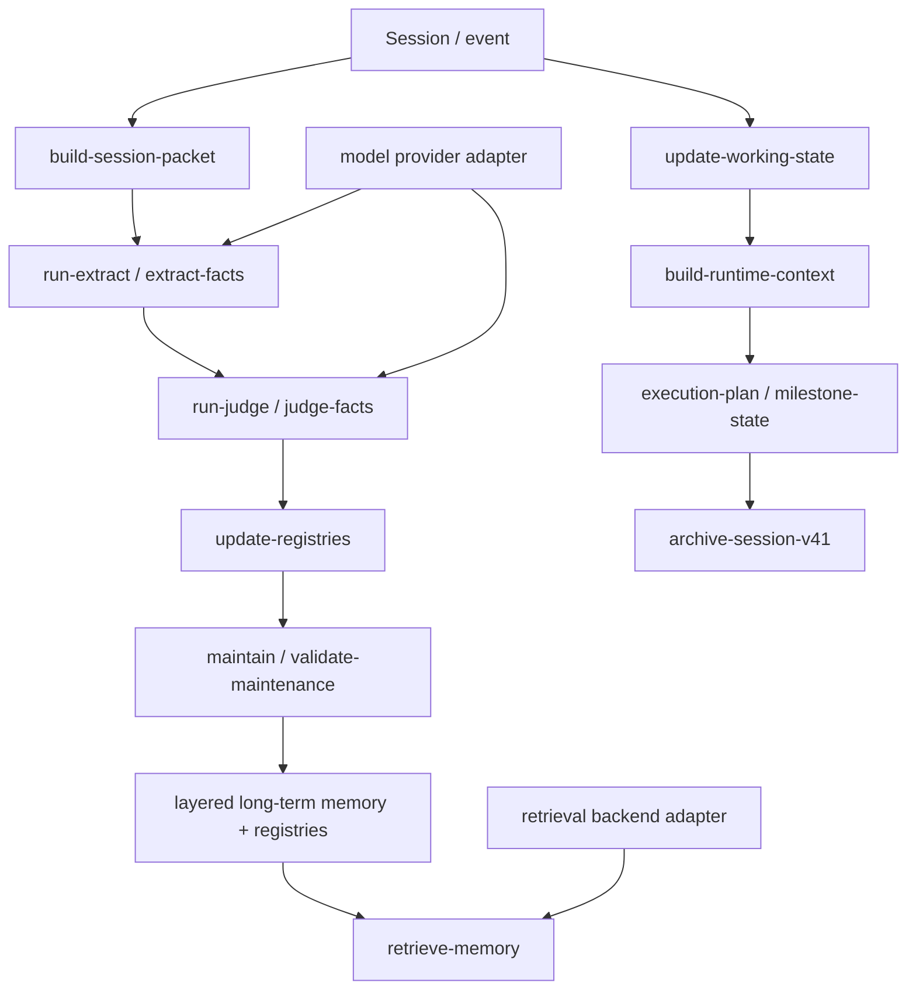

# Architecture

## Evolution

- **V1**: retrieval-first memory
- **V2**: layered memory (`L0/L1/L2/L3`) for guided retrieval and lower noise
- **V3**: lifecycle-aware governance for merge/supersede/expire/repair/validation
- **V4**: working memory and runtime context for active session continuity
- **V4.1**: execution/progress context and richer session/archive relationship

PruneMem now packages the public-safe architecture that emerged from **V2 + V3 + V4 + V4.1**.

## Core layered model

### Long-term memory plane
- layered memory files and retrieval targets
- registries for topic / dedupe / lifecycle / memory state
- archive → extract → judge → apply → maintain lifecycle

### Working-memory plane
- per-session working state
- append-only working events
- compact runtime context compiled for the next turn
- optional bridge items that can later become long-term memory candidates

### Execution/progress plane (V4.1)
- explicit execution plan
- milestone state
- progress reporting cadence / continuation hints
- execution context that can be combined with runtime context

### Archive plane (V4.1)
- closed-session archive snapshots
- transcript excerpt or equivalent source summary
- embedded working-state snapshot
- embedded runtime-context snapshot
- explicit relationship to future extraction/resume operations

## Core flow

## Public hook integration contract

The public repository intentionally avoids private event payload copies.

Instead it exposes a generic contract:

### `pre_turn`
Purpose:
- compile runtime context from current working state
- optionally append execution/progress context
- return a compact prepend/injectable context block

### `post_turn`
Purpose:
- parse the turn outcome into a working-state delta
- append a working event
- keep next actions / in-progress / blocked / completed state synchronized
- optionally surface candidate long-term memories for later V3 extraction/judgement

### `session_close`
Purpose:
- create a closed-session archive snapshot
- freeze the working-state snapshot for audit/resume
- preserve source material for later extraction into long-term memory

That contract is the public abstraction boundary.
