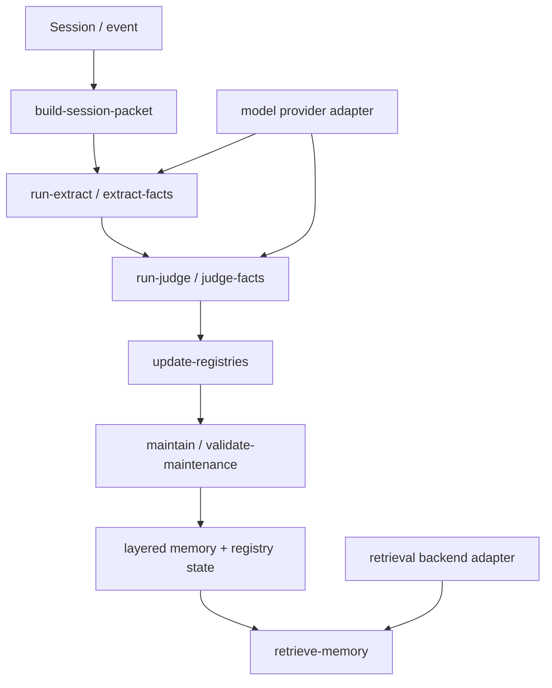

# Architecture

## Evolution

- V1: retrieval-first memory (for example QMD-backed search)
- V2: layered memory (`L0/L1/L2/L3`) for guided retrieval and lower noise
- V3: lifecycle-aware governance for merge/supersede/expire/repair/validation

PruneMem packages the practical system that emerged from V2 + V3 together.

## Core flow

1. archive a session/event
2. extract candidate facts
3. judge memory value and target
4. update registries
5. apply lifecycle governance
6. retrieve by structure and optional semantic backend

## Architecture diagram

## Public runnable chain

The open-source repository includes a portable runnable chain:

- `run-extract`
- `run-judge`
- `update-registries`
- `maintain`

A mock sample pipeline is included so users can validate repository wiring without needing live provider credentials.

## Current runtime notes

- `run-extract` validates session-packet input before execution.
- `run-judge` validates extracted-facts input before execution.
- provider errors are normalized into a stable shape for CLI output.
- the public default apply policy remains conservative and L1-first.
